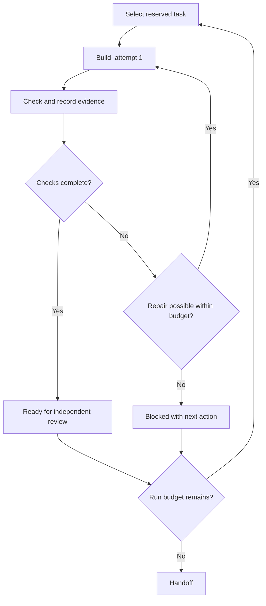

# Five-agent asset production

This scaffold prepares five cooperating contributors. It does not invoke models,
install connectors, schedule jobs, or start background agents. Use one prompt per
agent after this scaffold has been integrated into the branch used as their base.

## Ownership and categories

| Agent | Owned categories | Prefix | Boundary |
| --- | --- | --- | --- |
| structures | engineering-mechanics, structural-analysis, reinforced-concrete, steel-and-timber | str- | Members, supports, connections, structural response |
| materials | construction-materials | mat- | Construction specimens, appearance, sourced property cards |
| surveying | surveying | sur- | People, gait, field equipment, instrument actions |
| buildings | buildings, construction, building-systems | bld- | Envelopes, assemblies, construction sequence, service routing |
| water-ground | hydraulics-and-hydrology, geotechnical, engineering-geology | geo- | Water behavior, soil/geological models, ground interaction |

`orchestration/owners.json` is the ownership authority. Its queues reserve 40 IDs,
eight per agent. Transportation and mathematics remain unassigned until the
integrator expands the plan. Categories describe subject matter; ownership is not
a separate public taxonomy. Reusable components stay under the existing
`assets/<category>/<id>/` layout.

Each worker writes only its reserved asset directories and `work/<agent>/<id>/`.
Shared schemas, prompts, queues, contracts, dependencies, root documentation,
catalog/catalog.json, original examples, and deployment settings are integrator-owned.
No worker may add a task to its own queue or grant itself another category.

## Prepare and launch

First commit or integrate the scaffold. Worktree setup requires a clean checkout
and a base commit containing orchestration/owners.json. From the integrator checkout:

```sh
python scripts/validate_catalog.py
python scripts/validate_orchestration.py
python -m unittest discover -s tests -v
python scripts/prepare_agent_worktrees.py --run batch-001 --destination ../learnmat-workers-batch-001 --base HEAD
```

The included automated checks are limited to critical orchestration data-integrity
cases: cross-worktree edits, stale-writer locks, retry persistence, and stale
evidence. Structural validation alone cannot exercise those histories. They use
Python’s standard library and are not a requirement to create per-asset suites.

This creates five `agents/<agent>/batch-001` branches and separate working
directories. Each gets an ignored `.agent-workspace.json` containing agent, run,
branch, and full base SHA. Open each worktree in a separate agent session and use
its prompt from [instructions/agents](../instructions/agents/README.md). Do not run
five sessions against one checkout; their Git indexes and working files would collide.

Exactly one active run per agent is allowed, including on different machines or
clones. The integrator assigns runs and maintains that scheduling constraint.
Preparation rejects an existing worker worktree for the same domain, even with a
different run ID. After saving and integrating prior work and stopping its session,
the integrator retires the old worktree before preparing a new run.
Local locks live in the shared Git common directory and coordinate worktrees on
one clone only. They are not a distributed GitHub lock. Never start a replacement
clone while the original run may still write. No autonomous remote lock service is
claimed by this scaffold.

## Bounded loop and resumability

Each run can start three tasks per agent. Each task gets three total implementation
attempts, including its first. Reopening a session does not reset counters. A
blocked task consumes its task slot. Completed, blocked, or integrated tasks are
terminal for workers; only the integrator can plan follow-up work in a later change.



Example commands from the surveying worktree:

```sh
python scripts/agent_workflow.py begin --agent surveying --task sur-walking-person
python scripts/agent_workflow.py checking --agent surveying --task sur-walking-person
python scripts/agent_workflow.py repair --agent surveying --task sur-walking-person
python scripts/agent_workflow.py checking --agent surveying --task sur-walking-person
python scripts/agent_workflow.py fingerprint --agent surveying --task sur-walking-person
```

`begin` creates candidate metadata, a deliberately unimplemented module/demo,
runtime manifest, documentation templates, state, and evidence template. Implement
them before handoff. Set the metadata's real previewImage path and reviewFile;
document parameters and bounds in component.json and set implemented only after
implementation. Fill work/<agent>/<id>/evidence.json with observed results. Its
fingerprint covers every asset file, so update it after the final asset edit.

```sh
python scripts/agent_workflow.py ready --agent surveying --task sur-walking-person
```

Ready requires self-review evidence for engineering, pedagogy, functionality,
animation/presentation, spatial 3D quality, accessibility, visual quality, and reuse; an actual preview and review file; an implemented module;
current fingerprint; clean ownership checks; and passing catalog validation. It
does not independently verify those claims or approve public release. Keep asset
metadata candidate/in-review. Missing browser or graphics capabilities should
produce a blocker rather than a fabricated pass:

```sh
python scripts/agent_workflow.py block --agent surveying --task sur-walking-person --reason "Browser unavailable; source implemented but pose capture and interaction review remain pending."
```

Each transition writes state atomically. A local lock uses a random session token
and worktree identity, preventing another worktree from claiming the active task.
Two simultaneous commands within the same session are unsupported: the worker
must await each command before starting the next.

## Interruption recovery

Run `begin` for the same active task from the same worktree to resume without
resetting attempts. A crash during scaffolding can leave partial files; inspect
the recorded task and complete missing files within its assigned directory rather
than rerunning a destructive template generator. A crash after saving ready/blocked
but before lock release can be recovered with `release` for that same task/session.

If the worktree/session metadata is lost or a lock has incomplete owner data, stop
that domain and notify the integrator. Locks have no automatic expiry or stealing.
The integrator must establish that the previous writer has stopped, preserve its
changes and state, and reconcile the lock before assigning a replacement. Do not
delete another session's lock or reset the run ID to bypass budgets. Failed
worktree preparation preserves existing directories/branches for inspection.

## Educational production requirement

Every worker follows docs/EDUCATIONAL-DESIGN.md. New spatial assets are 3D-first:
workers should implement real 3D geometry/scenes comparable in visual ambition to
the surveying references, with 2D-primary output allowed only when the review gives
a concrete educational reason. An asset is not ready merely
because its geometry renders correctly. It must teach a meaningful concept or
procedure. Where an ordered method exists, preserve the learner's reasoning chain
with accurate intermediate states and checks. Keep the default interface concise
through progressive disclosure. Interactive/animated demos should support a
focus/maximize mode that removes lesson steps and nonessential chrome while
retaining a clear exit and essential animation controls.

Static assets may document that animation is not educationally necessary. Do not
add decorative motion solely to satisfy an animation checklist.

## Shared catalog and runtime contract

Workers do not edit a shared registry. `validate_catalog.py` reads the existing
intake index and discovers new asset.json files. `build_catalog.py` writes a
deterministically sorted, ignored `.build/catalog.json`. `--public` includes only
approved records. Neither command deploys, copies hosting files, or certifies
engineering results. Candidate scaffolds do not enter the public catalog.

Each new asset has a companion component.json and implements
[runtime v1](../contracts/ASSET-RUNTIME.md). Its coordinates and units are shared,
while its source, demo, styles, tests, and previews remain local. Shared dependencies
are injected by the host. Declared cross-asset dependencies must point to an
integrated approved version. Cross-agent private-source imports are prohibited by
the contract and checked in source review, not by a complete JavaScript resolver.

If another agent needs a shared helper, model, material, or API, record the proposed
contract and reason in work/<agent>/<id>/REQUEST.md. Block only dependent work and
continue another independent item. The integrator handles the shared change
separately, then all workers receive an explicitly planned updated base in a new run.

## Integrate serially

1. Receive the worker branch and its immutable base SHA. Verify the branch is from
   the assigned agent/run and inspect the complete diff against that base.
2. From the trusted integrator checkout, run
   `python scripts/check_agent_scope.py --agent AGENT --base BASE_SHA --root WORKER_PATH`.
   Use the integrator's script rather than executing a possibly edited worker copy.
   Policy is read from the base commit, so changing local ownership cannot widen it.
   The check includes committed, staged, unstaged, untracked, deleted, and renamed
   paths. It is a cooperative guard, not an access-control sandbox.
3. Independently review source, domain calculations, educational value, step-by-step
   reasoning where a real procedure exists, animation/presentation quality, minimal
   text hierarchy, focus/maximize behavior, browser behavior, actual visual evidence,
   runtime cleanup, and reuse rights. Re-run relevant checks. Self-review
   and a fingerprint show what was reviewed, not that the review was correct.
4. Integrate one branch at a time into a separate integration branch. If shared
   changes appear, stop and split/reconcile them; never choose ours/theirs blindly.
5. Run catalog/orchestration validation and relevant tests on the combined state.
   Resolve any duplicate ID, dependency, category, or stale evidence failure.
6. The integrator can mark the task integrated and record integrationEvidence with
   reviewer, source commit, and observed checks. If approving an asset, preserve the
   original self-review, add independent evidence, and update approval metadata.
   Integrated task state is distinct from public asset approval; an integrated
   candidate may still need rights or technical review.
7. Open/review the integration PR. Merging and deployment follow the user's current
   authorization; workers never perform them. No GitHub Actions are added or triggered.
8. Start a new run from the integrated base only after all previous writers have
   stopped and prior tasks have a clear disposition. Do not re-run the same task
   indefinitely under different run names.

Path isolation eliminates routine shared-file edits; it cannot promise there will
never be a semantic conflict. Independent domain review and serial integration
remain necessary, especially when assets are composed into one scene.
